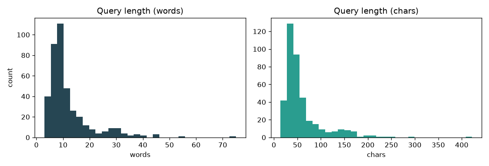
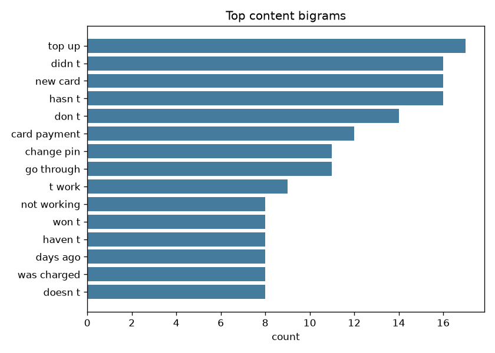
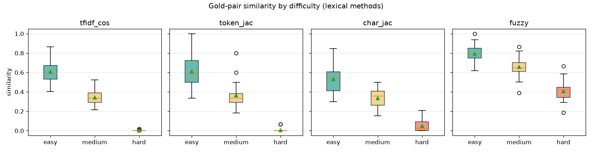
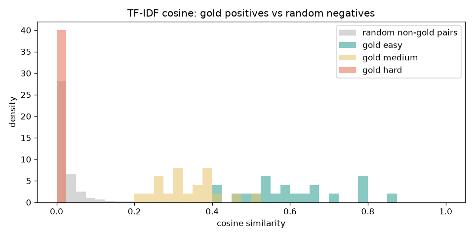

# Phase 0 — EDA: banking support queries

_Generated by `eda/eda_script.py`._

## 1. Corpus overview

- **400** queries, **400** unique ids, **0** empty texts.
- Length: **12.0** words avg (min 3, median 9, max 75); 60 chars avg.
- Exact-duplicate texts (case/space-insensitive): **0**.
- Queries with non-ASCII chars: **5**.

Shortest queries:
  - `I lost my card`
  - `Changing my PIN`
  - `I need a refund?`
Longest query:
  - `Hearing about your verification results from us may take anywhere from 10 minutes to approximately one hour.  If this verification has in fact, failed, double-c…`

## 2. Vocabulary & themes

- Vocabulary (content tokens, stopwords dropped): **598**.
- Top tokens: `card`(125), `t`(87), `why`(59), `payment`(58), `transfer`(47), `not`(47), `what`(45), `account`(38), `was`(38), `s`(36), `pin`(35), `need`(34)

## 3. Evaluation set structure (duplicate_pairs.csv)

- **60** labelled pairs across **20** root issues, **3** difficulties.
- Difficulty counts: easy=20, medium=20, hard=20
- Distinct queries referenced: **120** (6 per root issue, no query in >1 pair).

**Why this matters for evaluation.** Within one root issue all 6 queries describe the same problem, yet only 3 disjoint pairs are labelled. A good system *will* flag same-issue pairs that are not in the 60, so naive precision against the 60 is biased low. We therefore report two views:
  - **Headline recall** over the 60 pairs, split easy/medium/hard.
  - **Closed-set precision/recall/F1** on the 120 labelled queries, treating same-`root_issue` pairs as positive (**300** positives among 7140 candidate pairs).

## 4. Lexical similarity by difficulty (the core finding)

Mean similarity of the **gold positive pairs**, by difficulty:

| difficulty   |   tfidf_cos |   token_jac |   char_jac |   fuzzy |
|:-------------|------------:|------------:|-----------:|--------:|
| easy         |       0.607 |       0.611 |      0.532 |   0.791 |
| medium       |       0.342 |       0.365 |      0.335 |   0.657 |
| hard         |       0.002 |       0.007 |      0.048 |   0.408 |

**Reading it:** easy pairs are lexically obvious; medium degrades (typos, reordering); hard pairs are near-zero on every lexical metric — they share *meaning*, not words. This is the empirical case for the hybrid: lexical/fuzzy for easy+medium, semantic embeddings for hard.

## 5. Positive vs negative separability (TF-IDF)

Single-threshold TF-IDF baseline on the **closed 120-query set** (preview only; the real Phase-1 model is the hybrid):

| threshold | precision | recall | F1 |
|---|---|---|---|
| 0.2 | 0.70 | 0.18 | 0.29 |
| 0.3 | 0.88 | 0.13 | 0.22 |
| 0.4 | 0.96 | 0.08 | 0.15 |
| 0.5 | 1.00 | 0.06 | 0.11 |

Takeaway: lexical alone trades precision for recall and cannot reach the hard tier — confirming we need the semantic leg of the hybrid.

## 6. Implications for the pipeline

1. **Phase 1 (hybrid):** semantic embeddings as the recall backbone (needed for hard), lexical/fuzzy signals to sharpen easy+medium, kNN blocking to avoid the ~80k all-pairs comparison.
2. **Evaluation:** headline recall by difficulty on the 60 pairs + closed-set P/R/F1 via root_issue transitivity; audit a sample of off-gold predictions for true precision.
3. **Phase 2 (clustering):** ~20 root issues is a prior, but the full 400 likely span more intents — compare silhouette across several k.
4. **Phase 3 (LLM):** label clusters (not queries) -> ~k+1 calls; OpenAI-compatible, configurable, cached client + token/cost estimate.

