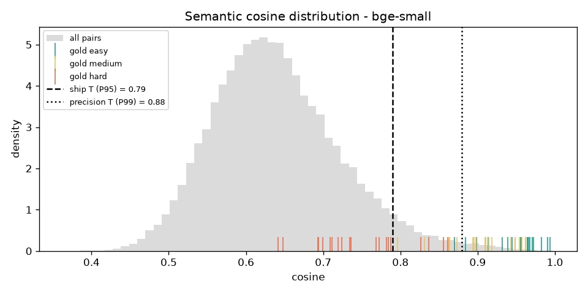
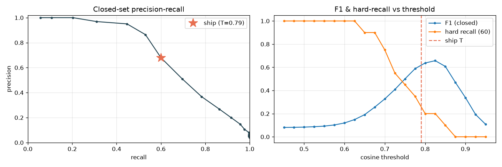

# Phase 1 — Hybrid duplicate detection

Find pairs of queries in `queries.csv` that describe the same underlying issue.

## Run

```bash
python phase1_dedup/dedup.py     # writes reports/report.md + figures/ + CSVs
```

First run downloads two embedding models (~220MB total) and caches embeddings
to `artifacts/`; re-runs are instant and offline. Full output:
[`reports/report.md`](reports/report.md).

## Approach

A **hybrid** with semantic embeddings as the backbone and lexical signals as a
safety net — chosen because EDA showed hard pairs share *meaning*, not words:

1. **Embed** every query with a local sentence-transformer (the LLM endpoint is
   chat-only). We compare two models and keep the winner.
2. **Block** candidate pairs at `cos ≥ 0.40` (at scale this is an ANN index;
   for 400 queries the full matrix is computed directly).
3. **Score** each candidate with semantic cosine + fuzzy token-sort ratio.
4. **Decide**: `cos ≥ T` **OR** `fuzzy ≥ 0.90`. The fuzzy clause rescues
   near-identical wording (typo'd medium pairs) the embedding ranks just under.

### Threshold without peeking (the key constraint)

`duplicate_pairs.csv` is eval-only, so the threshold is **not** fit to it.
`T` is the **95th percentile of the pairwise-similarity distribution** — a
label-free "duplicates are rare, flag the upper tail" prior. The labels are
used only to *score* the result and to draw the precision/recall curve.

Validation that this is a good label-free choice: the P95 threshold (**0.79**)
lands right next to the F1-optimal threshold on the labelled curve (**0.82**,
F1 0.66). P99 (**0.88**) is reported as a precision-oriented alternative.

## Results

**Model comparison** (shipped P95 operating point):

| model | T | easy | medium | hard | overall recall | closed P | R | F1 |
|---|---|---|---|---|---|---|---|---|
| **bge-small** (winner) | 0.79 | 1.00 | 1.00 | 0.20 | 0.73 | 0.61 | 0.63 | **0.624** |
| minilm | 0.58 | 1.00 | 0.95 | 0.20 | 0.72 | 0.52 | 0.56 | 0.538 |

**Winner — bge-small/bge-small-en-v1.5:**

- **Recall on the 60 pairs:** easy **1.00**, medium **1.00**, hard **0.20**, overall **0.73** (44/60).
- **Closed-set P/R/F1** (120 labelled queries, 300 transitive positives): **P 0.62 / R 0.63 / F1 0.62**.




The cosine plot is the whole story: easy/medium gold pairs live in the high
tail, but **hard pairs are buried inside the bulk** of all-pairs similarity —
by cosine they are indistinguishable from random different-issue pairs. The
right panel shows F1 peaking (~0.82) only *after* hard-recall has already
collapsed: precision and hard-recall cannot both be high.

## Missed-pair analysis (≥3, all hard tier)

All 16 misses are hard pairs. Three representative ones (cosine below the 0.79
threshold, fuzzy near zero):

| pair | cos | the two queries | why it's missed |
|---|---|---|---|
| Q005~Q228 | 0.65 | "My contactless is non-functional." / "Would reinstalling the app solve the problem?" | The second query never names the issue; it's only a duplicate given outside context. No surface or semantic overlap to latch onto. |
| Q019~Q023 | 0.69 | "My statement shows different transaction times." / "I have been double charged" | Same root issue ("extra charge on statement") but different *symptoms*; the embedding correctly sees two different complaints. |
| Q027~Q320 | 0.70 | "…on vacation in Spain and someone stole my…" / "card is lost, please help" | One is a long contextual story, the other a terse plea. "stolen" vs "lost" are near-synonyms operationally but the long query's extra content dilutes the embedding. |

These are genuinely ambiguous — a human needs context to link them — which is
why the hard tier caps out. The documented fix is an **LLM-judge** pass over
borderline candidates (cos 0.5–0.79); see "what I'd improve".

## Outputs (for Phase 2)

- `reports/predicted_pairs.csv` — detected duplicate pairs at the balanced point.
- `reports/merge_groups.csv` — **confident** high-precision groups (P99) for
  collapsing near-duplicates; leaves ~110 unique representatives from 400.
- `reports/missed_pairs.csv`, `reports/offgold_sample.csv` — error analysis +
  a sample of off-gold predictions for a manual precision audit.

## Tradeoffs & what I'd improve

- **Precision↔recall is a real knob, not a bug.** We ship the balanced point;
  flip to P99 for near-zero false merges (P 0.97, recall 0.32).
- **Connected-components over noisy pairs over-merges**, so the Phase-2 handoff
  uses the high-precision merge set, not the balanced one.
- **LLM-judge for the hard tier:** re-rank candidates in the 0.5–0.79 band with
  the LLM to recover hard pairs at acceptable precision (needs the endpoint).
- **Cross-encoder reranker** (e.g. a local MiniLM cross-encoder) would likely
  beat the bi-encoder on hard pairs without an API.
- **Asymmetric/instruction embeddings** (bge query prefixes) and light
  domain fine-tuning on the lexical-anchor pseudo-labels.
