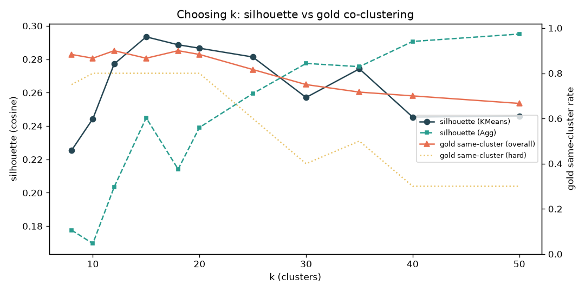
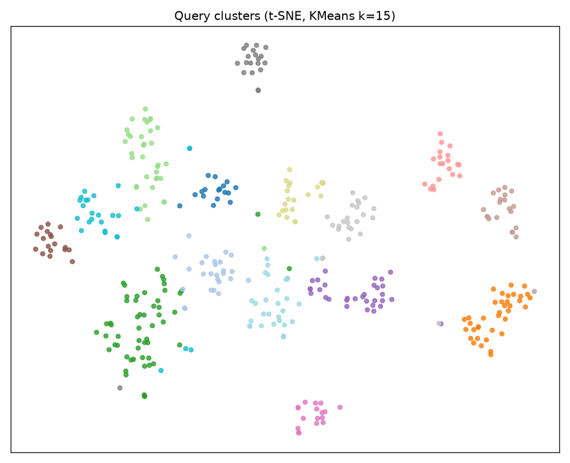

# Phase 2 — Clustering by issue type

Group the unique queries by issue type and justify the number of clusters.

## Run

```bash
python phase2_cluster/cluster.py    # writes reports/report.md + figures/ + CSVs
```

Reuses the cached bge-small embeddings from Phase 1. Full output:
[`reports/report.md`](reports/report.md).

## Approach

- **Embeddings:** bge-small (the Phase-1 winner), 384-dim, L2-normalised.
- **Algorithm:** KMeans across a grid of `k`; Agglomerative (cosine / average
  linkage) as a cross-check.
- **Scope:** cluster **all 400 queries**, not the deduped representatives, so
  cluster volumes reflect real ticket counts for the Phase-3 ops report.
- **k selection:** by **silhouette only** (unsupervised). The gold pairs are
  used *only* to report the same-cluster rate — never to choose `k`.

## Choosing k

Silhouette (cosine) is a gentle plateau around **0.28** for k = 12–20 — expected
for short, topically-homogeneous text with no crisp boundaries — and **peaks at
k = 15** for KMeans. Below k=12 themes are too broad; above k≈25 clusters
fragment and start splitting true duplicates.



Agglomerative silhouette keeps creeping up with k because average-linkage peels
off tiny/near-singleton clusters (which inflate silhouette without being
operationally useful), so we trust the KMeans peak. **Final choice: k = 15** —
slightly coarser than the 20 labelled root issues, meaning some narrow issues
merge into one cluster.

## Results (k = 15, KMeans)

- **Gold same-cluster rate: 87% overall** — easy **90%**, medium **90%**, hard **80%**.
  (i.e. 87% of the 60 ground-truth duplicate pairs land in the same cluster.)
- **Silhouette:** 0.293.
- **Cluster sizes:** largest 55, median 24, smallest 17 queries.



The 13-point gap between easy/medium (90%) and hard (80%) co-clustering mirrors
Phase 1: the same semantically-distant pairs that evade pairwise detection also
occasionally land in neighbouring clusters.

## Outputs (for Phase 3)

- `reports/clusters.csv` — every query with its cluster id.
- `reports/k_sweep.csv` — silhouette + gold co-clustering for every k tried.

## Tradeoffs & what I'd improve

- **Silhouette is weak here** (no sharp structure), so the choice rests on a
  plateau. HDBSCAN (density-based, auto-k + a noise class) would be a good
  cross-check and would isolate genuinely ambiguous queries instead of forcing
  them into a cluster.
- **k = 15 under-segments vs the 20 known issues** by design (silhouette-led).
  If the ops team wants finer buckets, k≈20 keeps gold co-clustering at ~88%.
- Clustering the **deduped representatives** and projecting back would reduce the
  pull of near-identical queries on centroids, but we kept all 400 for honest
  volume counts.
